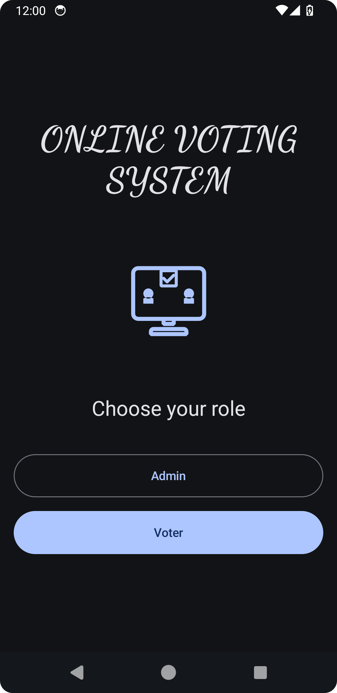
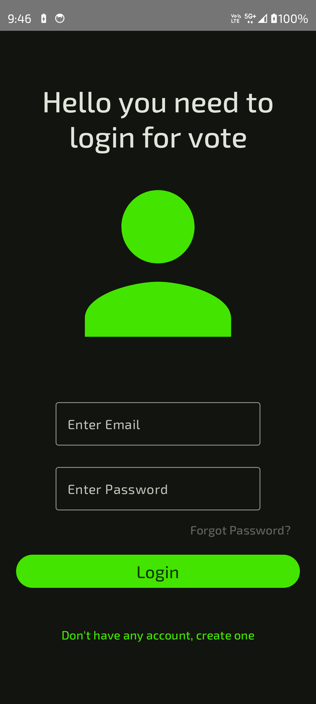
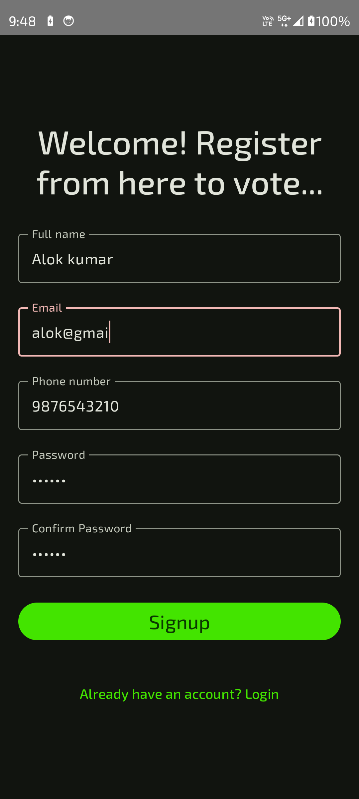
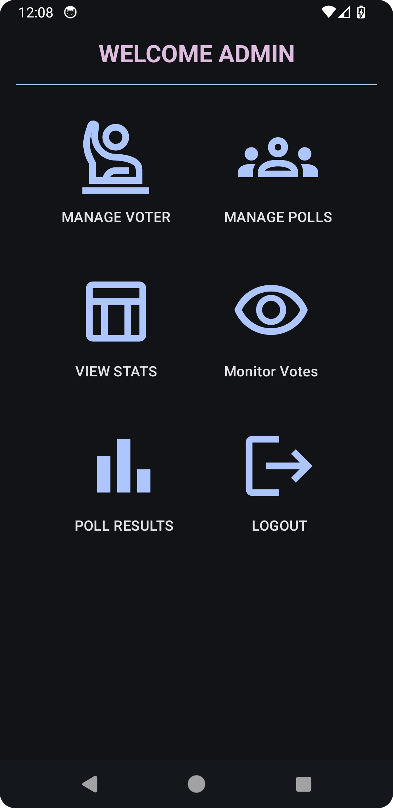
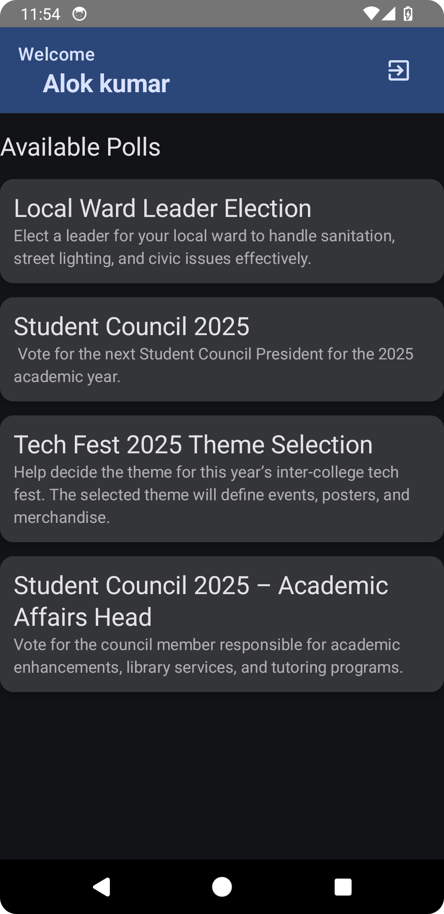
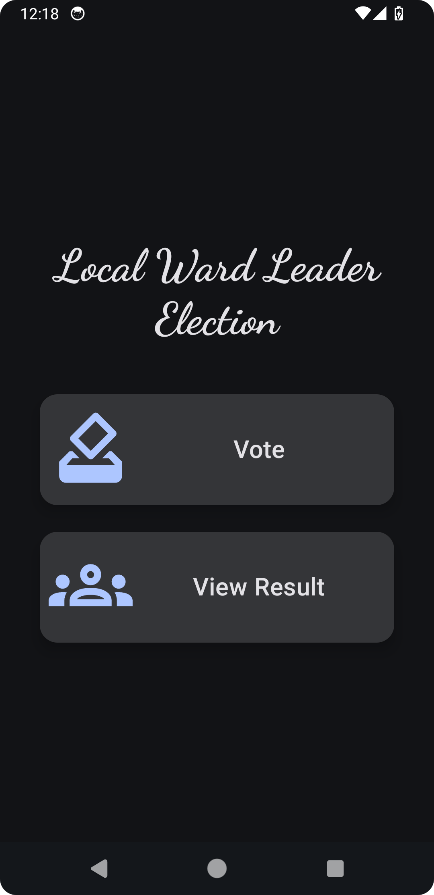
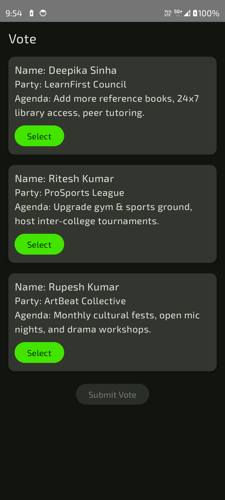

# 🗳️ Online Voting App

An Android application for secure and easy online voting. Built with **Jetpack Compose**, **Firebase Authentication**, and **Cloud Firestore**. It features two roles — **Admin** and **Voter** — with distinct access and functionality.

---

## 📱 Features

### 🔐 Authentication
- Role-based login (Admin / Voter)
- Firebase Authentication (Email & Password)
- Password reset functionality

### 🧑‍💼 Admin
- Manage polls (create, edit, delete)
- Manage candidates
- Manage voter list
- View poll results
- Secure access via admin login

### 🗳️ Voter
- Login or Sign Up
- View available polls
- Vote securely (one vote per poll)
- Real-time results display
- Firebase Firestore ensures data persistence

---

## 🧑‍🎨 Built With

| Tech                | Usage                           |
|---------------------|---------------------------------|
| **Kotlin**          | Android app logic               |
| **Jetpack Compose** | UI framework for modern Android |
| **Firebase Auth**   | Login/signup/reset via email    |
| **Cloud Firestore** | Store polls, users, votes       |

---

## 🏗️ Architecture

- MVVM Pattern using `ViewModel`
- Firestore SnapshotListeners for real-time UI updates
- Secure Firestore rules to prevent unauthorized access
- Navigation using `NavHostController`
- Role-based UI navigation (Admin vs Voter)

---

### 📸 Screenshots

#### 🔐 Authentication Screens

| Auth Screen                            | Login Screen                                                | Registration Screen                                   |
|----------------------------------------|-------------------------------------------------------------|-------------------------------------------------------|
|    |                        |           |
| Choose admin or voter                  | Login Screen for Voter; admin login screen looks similar    | Registration Screen for Voter, not for admins         |

---

#### 🏠 Landing Pages

| Admin Home Screen                    | Voter Poll List                                        |
|--------------------------------------|--------------------------------------------------------|
|  |                   |
| Home/Landing screen for Admin        | Landing page for Voter/User. Here they can select Poll |

---

#### 🗳️ Voter Screens

| Poll Action Screen                           | Vote Screen                             | Result Screen                     |
|----------------------------------------------|-----------------------------------------|-----------------------------------|
|  |            |  |
| Poll actions: Vote or View Result for Voter  | Voter selects and votes for a candidate | Voter sees the voting result      |

---


## 🚀 Getting Started

### Prerequisites
- Android Studio Hedgehog or later
- Firebase Project with:
  - Email/Password Authentication enabled
  - Firestore database setup
  - SHA1 & SHA256 keys added for debug/release

### Setup

1. Clone the repo:
   ```bash
   git clone https://github.com/your-username/online-voting-app.git
   cd online-voting-app

2. Connect to Firebase:
  Download google-services.json from Firebase Console
  Place it in app/ directory

3. Run the project:
  - Connect emulator or device
  - Click ▶️ Run in Android Studio

### TODO (Future Enhancements)

  - 🔐 Admin analytics dashboard
  - 📈 Voting stats chart
  - 🌐 Multi-language support

### 📫 Contact
  Feel free to reach out via:
- Gmail: dev.alokkumar.droid@gmail.com
- Telegram: https://t.me/dev_alokkumar_droid
